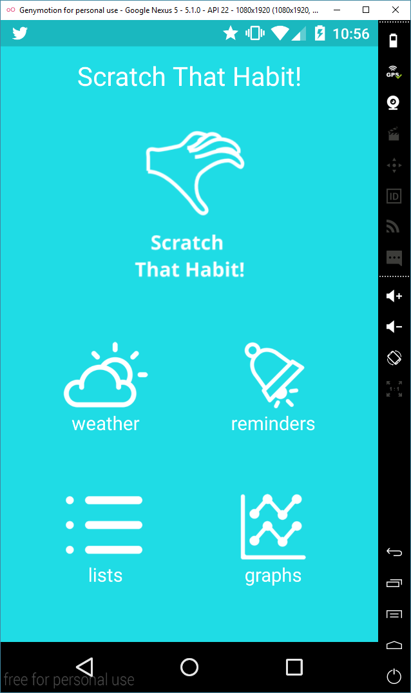
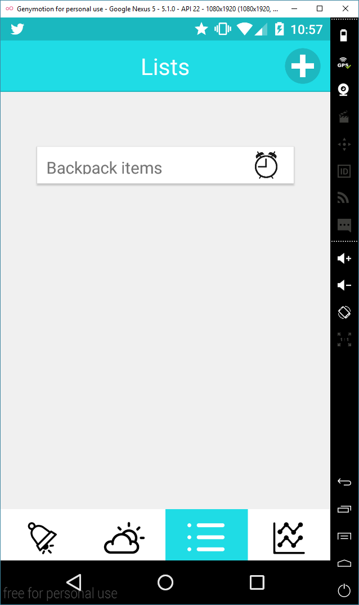
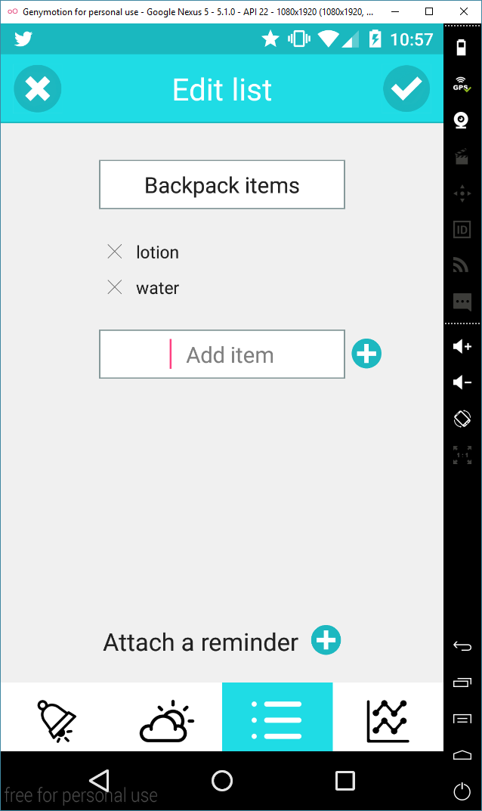
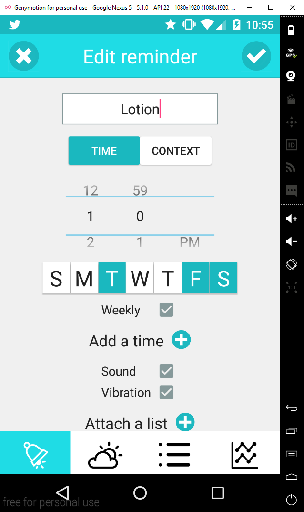
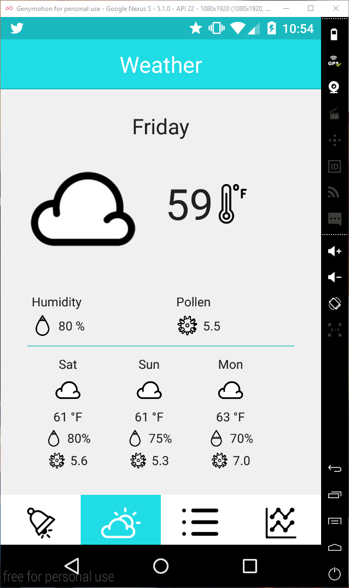
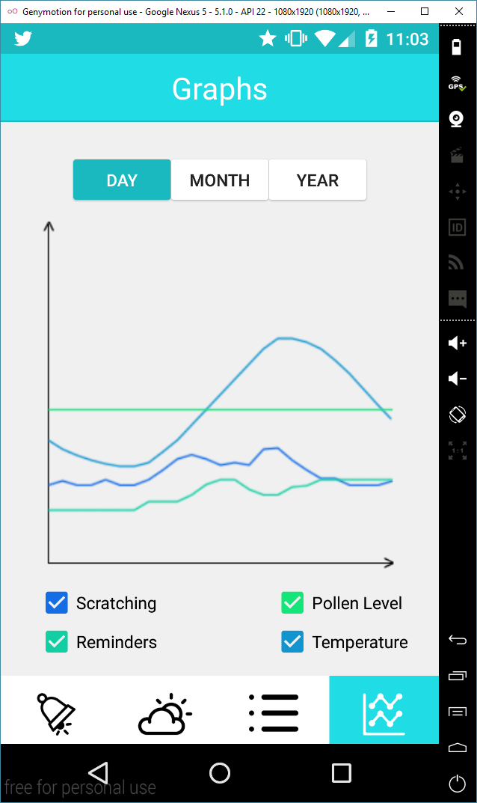
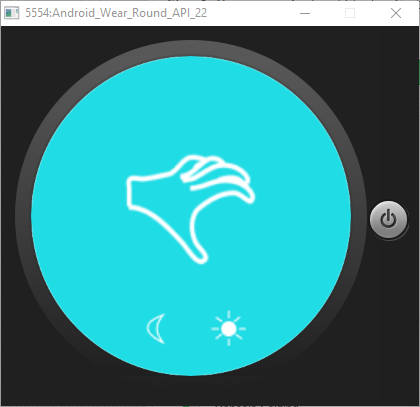
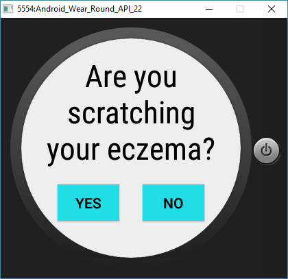
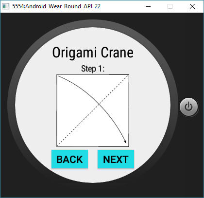

# Group-4-Project: Scratch That Habit

## Authors
* Diana Advani
* Sarah Au
* Simon Bonzon
* Tiffanie Lo
* Vignesh Muruganantham

## Screenshots

## Acknowledgments
Thanks to:
* Edward Boatman (Alarm icon)
* Creative Stall (Graph icon)
* Anas Ramadan (Save, Close, Add icons)
* factor[e] design initiatve (pollen icon)
* Timothy Miller (Humidity icons)
* Anuar Zhumaev (Weather icons)
* anbileru adaleru (Temperature icon)
* all icons were from [thenounproject](https://thenounproject.com/)
* [Jason McReynolds](http://jasonmcreynolds.com/?p=388) for help with the shake detection

#### Notes
For weather to work properly, internet must be enabled and the GPS must be set to a location within the United States.
